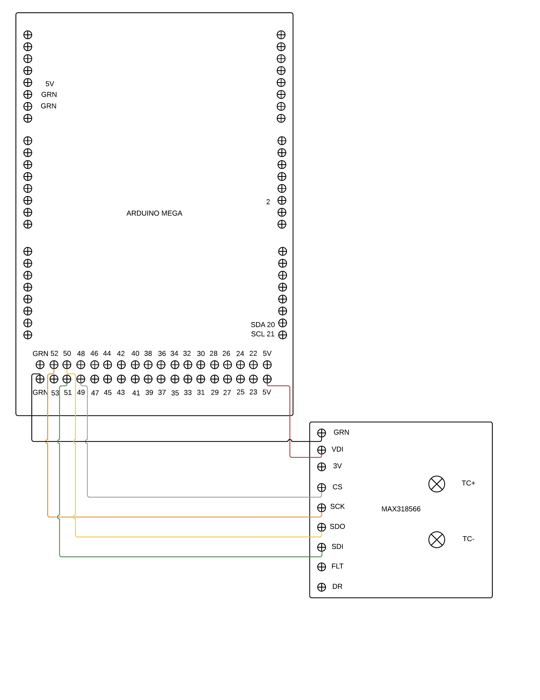
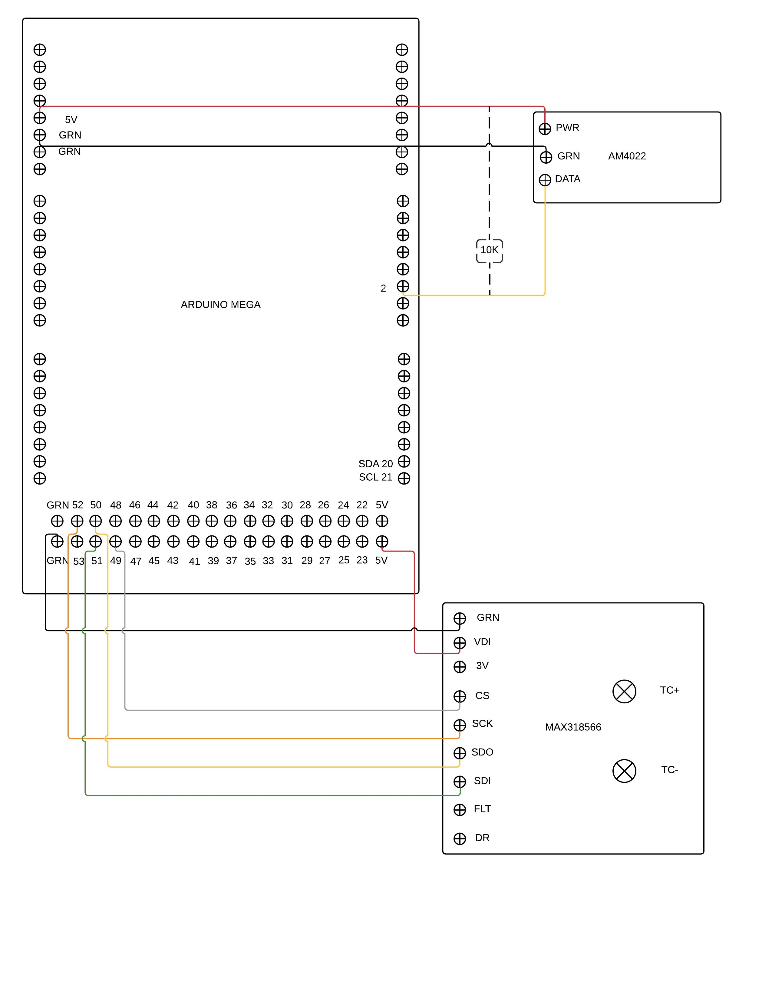
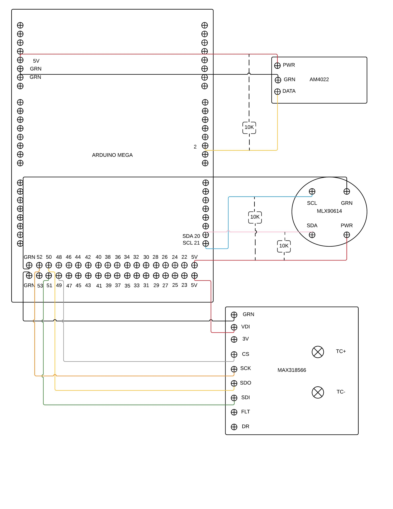

# ASSAMBLING TIHMMI

## Step 1: Put the Arduino Mega and the Adafruit GPS logger shield together as the instruction indicates

## Step 2: Adding the Digital Thermocouple Interface (MAX318566) to the Arduino Mega
 A- Connect the Thermocouple to the Interface.
 B- Connect the Interface to the Arduino Mega according to these instructions:
 
| Interface   | Arduino Mega |
|-------------|--------------|
| CS          | PIN 49       |
| SCK         | PIN 52       |
| SDO         | PIN 50       |
| SDI         | PIN 51       |
| GRN         | GRN          |
| VDI         | 5V           |

 
For more details see the diagram:

## Step 3: Adding the AM4022 to the Arduino Mega
Connect the Temperature and Humidity sensor acording to the next instructions:

| Sensor      | Arduino Mega |
|-------------|--------------|
| Red Wire    | 5V           |
| Black Wire  | GRN          |
| Yellow Wire | PIN 2        |

You will need to put a 10K resistor between the yellow wire and the red wire.

For more details see the diagram:

## Step 4: Adding the MLX90614 to the Arduino Mega
Connect the Infrared Termometer sensor as the diagram:

| Sensor      | Arduino Mega |
|-------------|--------------|
| PWR         | 5V           |
| GRN         | GRN          |
| SCL         | PIN 21(SCL)  |
| SDA         | PIN 20(SDA)  |

You will need to put a 10K between the SDA and the PWR.
You will need to put a 10K between the SCL and the PWR.

For more details see the diagram:

 
